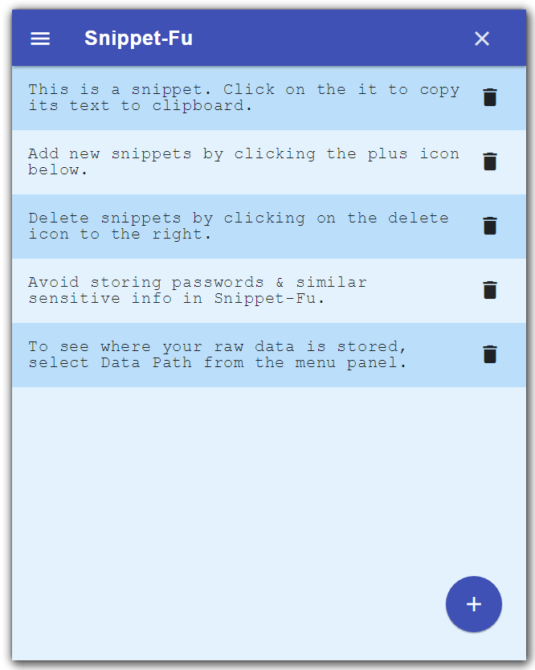

Snippet-Fu
==========
Snippet-Fu lets you store frequently used snippets
of text and copy them quickly to clipboard with just one click.
All data is stored offline in your own computer and absolutely
nothing is tracked or communicated over the network. 

In analytics, development, we often have to
repeatedly re-use long or complicated text like command lines, 
database connection strings etc. Using ad-hoc solutions like
text editors or note-taking apps to store these is fidgety and
error-prone due to having to select & copy text with risk of 
accidental overtyping.

Snippet-Fu simplifies this by copying snippets to clipboard 
by simply clicking on a list. It has a search functionality
function to quickly find what you are looking for and lets
you title cryptic snippets to make finding them easier. Unlike
clipboard managers, it will only keep what you explicitly
put into it and won't monitor your clipboard.

The snippets are stored as a plain JSON file in your local
data folder. Click the information icon to see the location
where the file is stored. Do not save passwords in Snippet-Fu.

History
-------
Snippet-Fu was originally released as a [Chrome app](https://chrome.google.com/webstore/detail/snippet-fu/goekbdcfildilcmmlodpfemnjlkjajco?hl=en)
but with [sun-setting](https://blog.chromium.org/2016/08/from-chrome-apps-to-web.html)
of the Chrome Apps platform for Windows and Linux, it is released
as a stand-alone app based on [Electron](http://electron.atom.io/).

Screenshots
-----------



Building
--------
This project is based on [Electron](http://electron.atom.io/) with 
[Electron Builder](https://www.electron.build/), [React](https://facebook.github.io/react/)
and [Material Components for Web](https://github.com/material-components/material-components-web-react/). It uses [Create React App](https://github.com/facebookincubator/create-react-app)
to bootstrap the react components and a modified version of the workflow
explained in [Kitze's blog](https://medium.com/@kitze/%EF%B8%8F-from-react-to-an-electron-app-ready-for-production-a0468ecb1da3)
to integrate CRA with Electron.

- Ensure you have [NodeJS](https://nodejs.org/) and [Yarn](https://yarnpkg.com/) in your development environment

- Clone the repository into a suitable location on the drive
  ```
  git clone https://github.com/srinathh/snippetfu.git
  ```
- Install all the development components and libraries through
  ```
  cd snippetfu
  
  yarn 
  ```
  
- To devlop locally, run the following yarn script
  ```
  yarn electron-dev
  ```

- To build the packed application, use the following script which calls `electron-builder`
  and packs executables for Linux, Mac & Windows. For more command line options, see
  the documentation for `electron-builder`
  ```
  yarn electron-pack -mwl
  ```
  
Contributing
------------
- The Linux build is well tested, Windows builds lightly tested & Mac un-tested. Testers wanted!
- Issues & pull requests welcome! Version 2 should make reproducible builds much easier. 

Changes from Version 1
------------------
- Integrated workflow between Electron & React
- New UI library - official React adapters of Material Components for Web
- Simpler architecture & fewer dependencies - specifically no more use of Redux
- Search functionality
